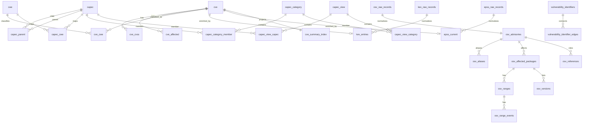

# データベース設計

qanvuliはSQLiteにCVEと関連フィードを正規化して保存する。現在のスキーマバージョンは`10`である。データベースは外部フィードから再構築できる派生物として扱い、未対応のスキーマをその場で移行しない。

## 基本方針

- 書き込みとスキーマ変更は1つの物理接続が所有する。
- 接続ごとに`PRAGMA foreign_keys = ON`を設定する。
- 公開APIではCVE、CWE、CAPEC、OSVなどの外部IDを使い、SQLiteの内部行IDを公開しない。
- 日時は検索と並び替えが可能なUTC文字列として保存する。
- 正規化で保持しないプロバイダー固有項目を参照できるよう、入力原文も保存する。
- 子テーブルの多くは`ON DELETE CASCADE`で親の削除に追従する。

## 全体関係

`kev_entries.cve_id`、`epss_current.cve_id`、識別子グラフ、検索投影には物理外部キーを設定していない。KEVとEPSSはインポート時に既知のCVEだけを採用し、派生テーブルは再生成できるためである。

## CVEとCWE

| テーブル | 主キー | 主な列 | 用途 |
|---|---|---|---|
| `cve` | `id` | `cve_id` (UNIQUE), `state`, `published_at`, `updated_at`, `serial`, `title`, `description_en`, `reference_text`, `raw_json` | CVEの親レコード |
| `cwe` | `id` | `description`, `status`, `parent_id` | CWEカタログ。CVE先行投入時はプレースホルダーを許可 |
| `cve_cvss` | `id` | `cve_db_id`, `version`, `base_score`, `base_severity`, `vector_string`, `source`, `raw_json` | CVSS指標 |
| `cve_affected` | `id` | `cve_db_id`, `vendor`, `product`, `package_name`, `collection_url`, `default_status`, `version_text`, `raw_json` | 影響製品とバージョン条件 |
| `cve_cwe` | (`cve_db_id`, `cwe_id`) | — | CVEとCWEの多対多関係 |

`cve_cvss`と`cve_affected`は`cve.id`、`cve_cwe`は`cve.id`と`cwe.id`を参照し、親削除時に連鎖削除される。`cwe.parent_id`はカタログ上の主要な`ChildOf`関係を保持する。

## CAPEC

### 本体と分類

| テーブル | 主キー | 主な列 | 用途 |
|---|---|---|---|
| `capec` | `id` | `name`, `description`, `extended_description`, `status`, `abstraction` | 攻撃パターン |
| `capec_parent` | (`capec_id`, `parent_id`) | `relation_order` | CAPEC間の親子関係 |
| `capec_cwe` | (`capec_id`, `cwe_id`) | `relation_order` | CAPECとCWEの対応 |
| `capec_category` | `id` | `name`, `status`, `summary` | CAPECカテゴリ |
| `capec_category_member` | (`category_id`, `capec_id`) | `member_order` | カテゴリの攻撃パターン |
| `capec_view` | `id` | `name`, `view_type`, `status`, `objective`, `filter` | CAPECビュー |
| `capec_view_category` | (`view_id`, `category_id`) | `member_order` | ビューに属するカテゴリ |
| `capec_view_capec` | (`view_id`, `capec_id`) | `member_order` | ビューに直接属する攻撃パターン |

`relation_order`と`member_order`はカタログの表示順を保持する。`capec_parent`は`capec`への自己参照であり、インポート前に循環を検査する。

### 参照、履歴、注記

| テーブル | 親 | 用途 |
|---|---|---|
| `capec_external_reference` | — | 外部文献の書誌情報 |
| `capec_external_reference_author` | `capec_external_reference` | 著者と順序 |
| `capec_reference` | `capec`, `capec_external_reference` | 攻撃パターンから文献への参照 |
| `capec_category_reference` | `capec_category`, `capec_external_reference` | カテゴリから文献への参照 |
| `capec_view_reference` | `capec_view`, `capec_external_reference` | ビューから文献への参照 |
| `capec_category_history` | `capec_category` | カテゴリの変更履歴 |
| `capec_view_history` | `capec_view` | ビューの変更履歴 |
| `capec_category_note` | `capec_category` | カテゴリ注記 |
| `capec_view_note` | `capec_view` | ビュー注記 |
| `capec_category_taxonomy_mapping` | `capec_category` | 外部分類体系との対応 |

順序を持つ子要素は、親IDと`*_order`の組を主キーにする。

## フィードと同期状態

| テーブル | 主キー | 用途 |
|---|---|---|
| `schema_meta` | 固定`rowid = 1` | スキーマバージョン |
| `db_sources` | `source` | CVE、OSV、KEV、EPSSの名称、形式、既定ファイル |
| `source_sync_state` | `source` | 試行日時、成功日時、状態、エラー、カーソル、ハッシュ、件数 |
| `app_metadata` | `key` | OSV選択範囲などのアプリケーション設定 |
| `read_json_file` | (`filename`, `md5hash`) | 読み込んだJSONファイルの記録 |
| `cve_zip_file` | `id` | 適用済みCVE ZIPと公開日時 |
| `osv_raw_records` | `id` | OSV原文、取得元、プロバイダー日時、内容ハッシュ |
| `kev_raw_records` | `id` | KEV原文と内容ハッシュ |
| `epss_raw_records` | `id` | 日付単位のEPSS CSV原文と内容ハッシュ |

OSVの同期カーソルは、レコード投入、検索投影更新、スキーマ検査がすべて成功した後に更新する。失敗時は前回成功カーソルを維持する。

## OSV、KEV、EPSS

| テーブル | 主キー | 主な列 | 用途 |
|---|---|---|---|
| `osv_advisories` | `osv_id` | `schema_version`, `published_at`, `modified_at`, `withdrawn_at`, `summary`, `details`, `raw_record_id` | OSVアドバイザリ |
| `osv_aliases` | (`osv_id`, `alias_id`) | — | CVE、GHSAなどの別名 |
| `osv_affected_packages` | `id` | `osv_id`, `affected_order`, `ecosystem`, `package_name`, `purl` | 影響パッケージ |
| `osv_ranges` | `id` | `affected_package_id`, `affected_order`, `range_order`, `range_type` | バージョン範囲 |
| `osv_range_events` | `id` | `range_id`, `event_type`, `value`, `event_order` | introduced、fixed、last_affected、limit |
| `osv_versions` | (`affected_package_id`, `version`) | — | 明示された影響バージョン |
| `osv_references` | (`osv_id`, `url`) | `reference_type` | 外部参照 |
| `osv_cve_search` | (`osv_id`, `cve_id`) | — | OSVからローカルCVEを引く検索投影 |
| `osv_token_cve_search` | (`token`, `cve_id`) | `state`, `published_at` | OSV検索語からCVEを引く投影 |
| `kev_entries` | `cve_id` | ベンダー、製品、追加日、対処、期限、ランサムウェア利用 | CISA KEVの正規化結果 |
| `epss_current` | `cve_id` | `epss`, `percentile`, `score_date`, `model_version` | 現在のEPSSスナップショット |

OSVの子テーブルは`osv_advisories`から連鎖削除する。`epss_current`はステージング後にトランザクション内で全置換し、新しいスナップショットにないCVEの古いスコアを残さない。

## 識別子グラフ

| テーブル | 主キー | 用途 |
|---|---|---|
| `vulnerability_identifiers` | `identifier` | 識別子種別、出典、初回・最終確認日時 |
| `vulnerability_identifier_edges` | (`from_identifier`, `to_identifier`, `relation_type`, `source`) | alias、upstream、relatedの有向辺と根拠 |
| `identifier_components` | `identifier` | alias連結成分を表す派生ID |

同一性の推移解決には`alias`だけを使用する。`upstream`と`related`は同一脆弱性であることを保証しないため、別の辺として保持する。OSV関係を再投入した後は辺を再生成し、変更前の辺を残さない。

## インデックス

主キーとUNIQUE制約が作る自動インデックスに加え、次のインデックスを定義する。

### CVE

| インデックス | 列 | 主な用途 |
|---|---|---|
| `idx_cve_published_at_cve_id` | `cve(published_at, cve_id)` | 公開日時順の一覧と範囲検索 |
| `idx_cve_updated_at_cve_id` | `cve(updated_at, cve_id)` | 更新日時順の一覧と差分検索 |
| `idx_cve_cvss_cve_db_id` | `cve_cvss(cve_db_id)` | CVE詳細へのCVSS結合 |
| `idx_cve_cvss_severity_score` | `cve_cvss(base_severity, base_score)` | 深刻度とスコア検索 |
| `idx_cve_affected_cve_db_id` | `cve_affected(cve_db_id)` | CVE詳細への影響製品結合 |
| `idx_cve_affected_vendor_product_cve_db_id` | `cve_affected(vendor, product, cve_db_id)` | ベンダー・製品検索 |
| `idx_cve_cwe_cwe_id_cve_db_id` | `cve_cwe(cwe_id, cve_db_id)` | CWEからCVEへの逆引き |

### CAPEC

| インデックス | 列 | 主な用途 |
|---|---|---|
| `idx_capec_status_type` | `capec(status, abstraction, id)` | 状態・抽象度フィルター |
| `idx_capec_parent_parent` | `capec_parent(parent_id, capec_id)` | 子要素の列挙 |
| `idx_capec_cwe_cwe` | `capec_cwe(cwe_id, capec_id)` | CWEからCAPECへの逆引き |
| `idx_capec_category_member_capec` | `capec_category_member(capec_id, category_id)` | CAPECが属するカテゴリ |
| `idx_capec_view_capec_capec` | `capec_view_capec(capec_id, view_id)` | CAPECが属するビュー |
| `idx_capec_view_category_category` | `capec_view_category(category_id, view_id)` | カテゴリが属するビュー |

### OSVと識別子

| インデックス | 列 | 主な用途 |
|---|---|---|
| `idx_osv_raw_records_content_hash` | `osv_raw_records(content_hash)` | 未変更レコードのスキップ |
| `idx_osv_aliases_alias` | `osv_aliases(alias_id)` | CVEなどからOSVへの逆引き |
| `idx_osv_cve_search_cve_id` | `osv_cve_search(cve_id)` | CVEからOSV検索投影への逆引き |
| `idx_osv_affected_packages_lookup` | `osv_affected_packages(ecosystem COLLATE NOCASE, package_name COLLATE NOCASE)` | パッケージ検索 |
| `idx_osv_affected_packages_osv_id` | `osv_affected_packages(osv_id)` | アドバイザリの影響パッケージ |
| `idx_osv_ranges_package` | `osv_ranges(affected_package_id)` | パッケージの範囲評価 |
| `idx_osv_range_events_range` | `osv_range_events(range_id, event_order)` | 範囲イベントの順序付き取得 |
| `idx_identifier_edges_from` | `vulnerability_identifier_edges(from_identifier)` | 出辺の取得 |
| `idx_identifier_edges_to` | `vulnerability_identifier_edges(to_identifier)` | 入辺の取得 |
| `idx_identifier_components_component` | `identifier_components(component_id)` | alias連結成分の列挙 |

`idx_read_json_file_filename`は、同一ファイル名の取り込み履歴を検索する。

## FTS5

FTS5仮想テーブルはすべて`unicode61`トークナイザーを使用する。外部ID列は結果を特定するために保持するが、`UNINDEXED`として全文検索対象から除外する。

| FTSテーブル | 検索列 | 元データ |
|---|---|---|
| `cve_summary_fts` | `title`, `description_en`, `affected_text`, `reference_text` | `cve_summary_index` |
| `cve_affected_summary_fts` | `vendor_text`, `product_text`, `affected_text` | `cve_summary_index` |
| `osv_text_fts` | `summary`, `details`, `aliases`, `packages` | `osv_advisories`とOSV子テーブル |

### CVE検索投影

`cve_summary_index`はCVEごとに検索文書を1行持つ通常テーブルである。

- `cve_db_id`を主キーとし、FTSの`rowid`にも使用する。
- `affected_text`はvendor、product、package、versionを連結する。
- `vendor_text`と`product_text`は影響製品専用FTSへ渡す。
- `reference_text`はCVE正規化時に作成した参照文字列を保持する。

全件初期化では正規化テーブルの投入後に投影とFTSをまとめて構築する。CVE差分更新では変更されたCVE IDだけを`cve_summary_index`と2つのFTSから削除し、再挿入する。

### OSV検索投影

`osv_text_fts`はアドバイザリ本文に加え、別名と`ecosystem`、パッケージ名、PURLを集約する。
通常の差分更新では変更されたアドバイザリだけを更新し、遅延インデックスを使う一括投入では全件再構築する。

### 整合性

- 通常のヘルスチェックは先頭・末尾の固定センチネルで投影対応を確認する。
- `db check --scan`と`db check --full`はFTS5のネイティブintegrity checkを実行する。
- 完全検査では通常テーブルとFTSの双方について不足行・余分な行を`EXCEPT`で検査する。
- `db rebuild-search`はCVEとOSVの検索投影を再生成して検証する。

## 更新と置換

`init`は候補DBを既存DBと同じディレクトリに構築し、スキーマ、検索投影、インデックスを検証して接続を閉じた後に置き換える。置換失敗時はバックアップから復元する。

一括投入では更新コストの高いインデックスと検索投影を後回しにし、投入後に再構築する。
差分更新ではCVEとOSVの変更行だけを更新する。`db check`系コマンドは検査範囲に応じてスキーマ、外部キー、SQLite、FTS、投影対応を確認する。
